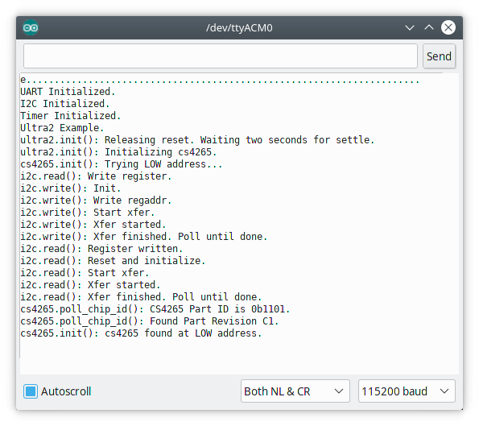

# rpi3fxproc
## Raspberry Pi 3 Bare Metal Effects Processor. 

Implements a bare metal headless full-duplex audio effects processor using a Raspberry Pi 3 embedded computer and an Audio Injector Ultra 2 Sound Card.

Currently pre-alpha. Try changing to the `rpibmtkr` subdirectory and running:

```
make clean examples
```

Serial output from ultra2 example:


