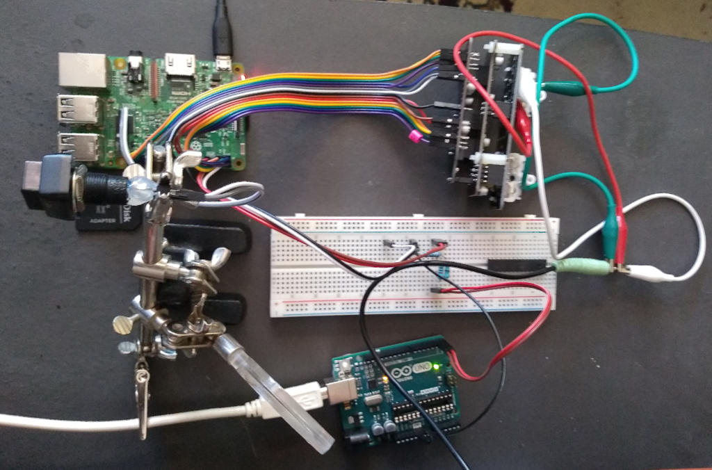

# rpi3fxproc
## Raspberry Pi 3 Bare Metal Effects Processor. 

Implements a bare metal OS-less full-duplex audio effects processor using a Raspberry Pi 3 embedded computer and an Audio Injector Ultra 2 Sound Card.

This project contains code Copyright (c) 2018 Andre Richter <andre.o.richter@gmail.com> and bzt [https://github.com/bztsrc](https://github.com/bztsrc). 

Much of the RPi hardware specific code in this project is derived from information in the "Bare-metal and Operating System development tutorials in Rust on the Raspberry Pi 3" [https://github.com/rust-embedded/rust-raspi3-OS-tutorials](https://github.com/rust-embedded/rust-raspi3-OS-tutorials). This is a recommended resource for anyone interested in learning the specifics involved in solving problems in this particular domain.



## Status

Currently pre-alpha.
(11/10/2019) Fixed I2S misconfigurations for output. Implementing a simple delay for testing input->output.
(09/15/2019) Stalled on troubleshooting why the Broadcom SOC's i2s subsystem isn't communicating with the Ultra2 sound card.

## Installation

### Dependencies

Install cargo-xbuild and cargo-binutils libraries. These do most of the work to make sure the rust dependencies for generating ARM code for the RPi3 are met.

```
$ cargo install cargo-xbuild cargo-binutils
```

### Bare-Metal

This software relies on the RaspberryPi Bare Metal Toolkit In Rust `rpibmtkr` library included in this repository. See the "README.md" file in the `rpibmtkr` directory for more details.

### Bootloader

For development it's recommended to use a serial booloader like `rpi3serbtldr` included in this repository. See the "README.md" in the `rpi3serbtldr` directory for details on installation and use.

### Build

After reading the various README files, installing the dependencies and bootloader try changing to the `rpibmtkr` subdirectory and running:

```
$ make clean examples
```

Then:

```
$ ../rpi3serbtldr/tx/rpi3serbtldr_tx -b 115200 -p "/dev/ttyACM0" -f "timer" -t 8000

rpi3serbtldr_tx
---------------
File: timer
Port: "/dev/ttyACM0"
Baud: 115200
Timeout(ms): 8000

Begin...
Receieved break signal.
Sent file size: 1872.
Got OK signal.
Sending file.
Got OK signal.
File sent successfully. Read and echo replies.
Timer1: Begin one second one shot delay.
Timer1: End one second one shot delay.
Timer3: Begin one second one shot delay.
Timer3: End one second one shot delay.
^C
```
